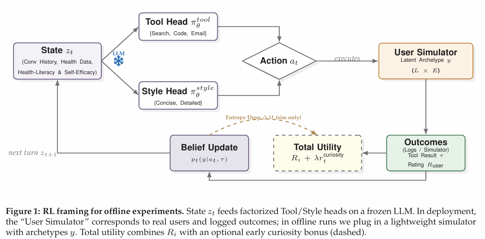

# Offline Policy Evaluation of Multi-Turn LLM Health Coaching with Real Users

This repository accompanies the NeurIPS MTI LLM workshop paper **“Offline Policy Evaluation of Multi-Turn LLM Health Coaching with Real Users.”**  
It provides:

- A de-identified multi-turn conversation dataset from a web-deployed, tool-augmented LLM health coach
- An appendix PDF with additional implementation and experimental details

---

## Abstract

We study a web-deployed, tool-augmented LLM health coach with real users. In a pilot with seven users (280 rated turns), offline policy evaluation (OPE) over factorized decision heads (TOOL/STYLE) shows that a uniform heavy-tool policy raises average value on logs but harms specific subgroups, most notably low–health-literacy / high–self-efficacy users. A lightweight simulator with hidden archetypes further shows that adding a small early information-gain bonus reliably shortens trait identification and improves goal success and pass@3. Together, these early findings indicate an evaluation-first path to personalization: freeze the generator, learn subgroup-aware decision heads on typed rewards (objective tool outcomes and satisfaction), and always report per-archetype metrics to surface subgroup harms that averages obscure.

---

## Diagram

---

## Contact

For questions about the paper or dataset, please contact: **mozolcer@stevens.edu**
